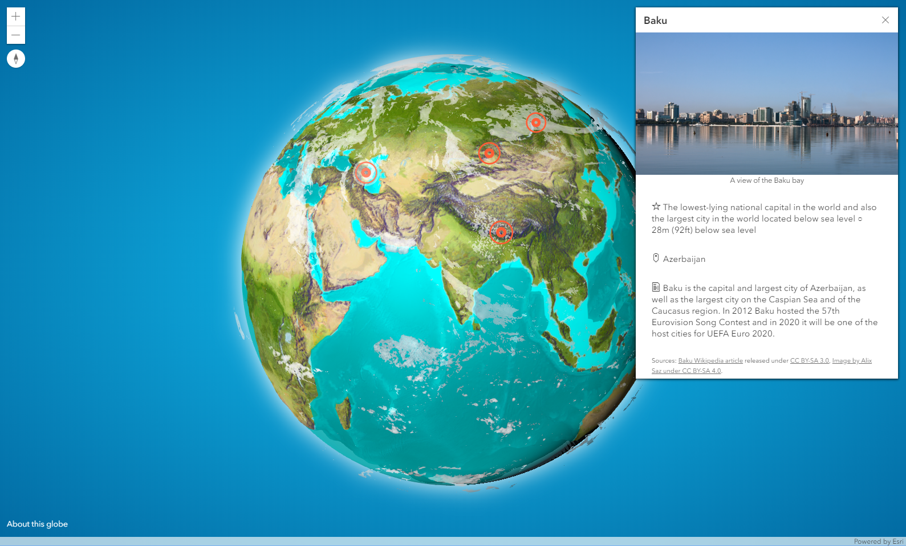

# The globe of extremes

3D Globe created by [John](https://www.esri.com/arcgis-blog/author/j_nelson/) and [Raluca](https://www.esri.com/arcgis-blog/author/raluca_zurich/) after getting inspired by [this awesome globe](https://www.fonterra.com/nz/en/campaign/from-here-to-everywhere.html#/home), [this awesome globe](https://www.instagram.com/p/Bt8zyI-gsqW/) and [this awesome globe by Vizzuality](https://www.half-earthproject.org/maps/). We used [ArcGIS API for JavaScript](https://developers.arcgis.com/javascript/) to create the interactive globe and [ArcGIS Pro](https://pro.arcgis.com/) to create the basemap. We used this [Wikipedia article](https://en.wikipedia.org/wiki/Extreme_points_of_Earth) to get a list of extreme points on Earth and this [cloud image](https://visibleearth.nasa.gov/view.php?id=57747) from NASA Goddard Space Flight Center (image by Reto Stöckli) for the cloud layer.

I wrote about how to create the interactive globe in this [blog post](https://www.esri.com/arcgis-blog/products/js-api-arcgis/3d-gis/interactive-3d-globe/) and John wrote about the Vibrant basemap that he created for Half-Earth project in this [blog post](https://www.esri.com/arcgis-blog/products/arcgis-pro/mapping/creating-the-half-earth-vibrant-basemap/).

[View it live](https://ralucanicola.github.io/the-globe-of-extremes/)
